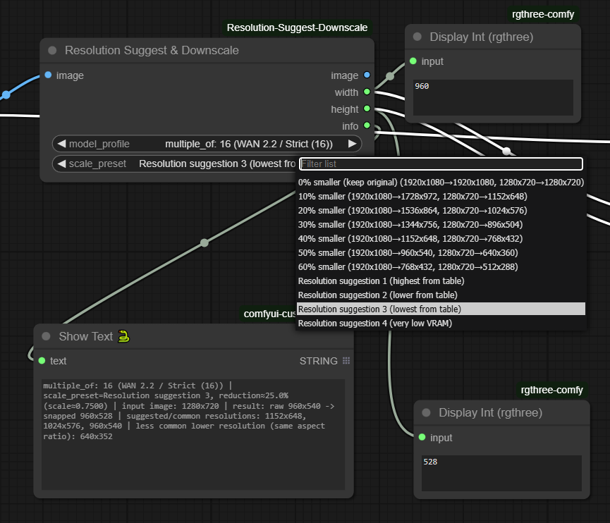

# Tuono Resolution Suggest & Downscale

This is a simple resolution suggester that downscales images. It preserves aspect ratio and uses hardcoded suggested resolutions that were provided by ChatGPT 5.1 based on common resolutions and common downscaled targets. None of the suggested or common resolutions in this program were authored by me; they were provided by ChatGPT.  

Use the output info: STRING with diagnostic details, for easy debugging

The entire code was generated by ChatGPT 5.1, I have no programming experience.

And rest of this readme file is done by Chatgpt.

A ComfyUI custom node that helps you pick sensible downscaled resolutions for an input image. It preserves the aspect ratio, snaps to a chosen multiple (8/16/32/64), and never upscales beyond the source size.

- Input: Image tensor
- Output: Passthrough image, target width/height, and a human-readable info string

---

## Highlights

- Multiple-of snapping profiles: 8, 16, 32, 64
- Two ways to choose the target size:
  - Percentage presets (e.g., 10–60% smaller)
  - Resolution suggestions from a static table for common input sizes
- Never upscales beyond the original resolution
- Structurized info string shows what happened (profile, preset, scale/reduction, raw/scanned sizes, suggestions)

---

## Inputs

- image: ComfyUI IMAGE tensor (passthrough)
- model_profile:
  - multiple_of: 8 (SD / General (8))
  - multiple_of: 16 (WAN 2.2 / Strict (16))
  - multiple_of: 32 (Video / Advanced (32))
  - multiple_of: 64 (Legacy / Extra Safe (64))
  - Default: 16
- scale_preset:
  - Percentage-based:
    - 0% smaller (keep original)
    - 10% smaller
    - 20% smaller
    - 30% smaller
    - 40% smaller
    - 50% smaller
    - 60% smaller
    - Default: 30% smaller
  - Resolution suggestions:
    - Resolution suggestion 1 (highest from table)
    - Resolution suggestion 2 (lower from table)
    - Resolution suggestion 3 (lowest from table)
    - Resolution suggestion 4 (very low VRAM)

Notes:
- Percentage presets compute a scale factor, apply to the input, then snap to the chosen multiple_of.
- Suggestion presets try known resolutions for the current input from an internal table; if the input is unknown:
  - Suggestion 1 → ~80%
  - Suggestion 2 → ~70%
  - Suggestion 3 → ~60%
  - Suggestion 4 → ~50%

---

## Outputs

- image: Passthrough of the original IMAGE tensor
- width: INT target width (snapped)
- height: INT target height (snapped)
- info: STRING with diagnostic details, for easy debugging

Example info:

multiple_of: 16 (WAN 2.2 / Strict (16)) | scale_preset=Resolution suggestion 1, reduction≈12.5% (scale≈0.8750) | input image: 1024x1024 | result: raw 896x896 -> snapped 896x896 | suggested/common resolutions: 896x896, 768x768, 640x640 | less common lower resolution (same aspect ratio): 512x512

---

## How sizes are picked

- Aspect ratio preserved
- Snapping:
  - Target dimensions are rounded down to the nearest multiple_of
  - Never exceeds the original size (no upscaling)
- Suggestions:
  - For known inputs (e.g., 1920×1080, 1280×720, 1024×1024, 896×1152, etc.), the node consults a static table of common downscaled resolutions
  - Suggestion 1/2/3 → first/second/third entry from the table (highest to lower)
  - Suggestion 4 → always a dynamically computed ~50% downscale (snapped), intended for very low VRAM

---

## Installation

1. Go to your ComfyUI `custom_nodes` directory
2. Clone this repository into it:
   ```
   ComfyUI/
     custom_nodes/
       ComfyUI-TuonoResolutionSuggestDownscale/
         tuono_resolution_suggest_downscale.py
         README.md
         pyproject.toml
         .github/
           workflows/
             publish.yaml
   ```
3. Restart ComfyUI

You should find the node as:
- Name: Resolution Suggest & Downscale
- Category: Resolution/Utilities

---

## Usage

Typical workflow:
- Load Image → connect IMAGE to Tuono Resolution Suggest & Downscale.image
- Choose:
  - model_profile (e.g., multiple_of: 16)
  - scale_preset (e.g., Resolution suggestion 2 or a percentage preset)
- Connect:
  - width → Resize Image (V2).width
  - height → Resize Image (V2).height
- Optional:
  - Connect info → Show Text/Print for debugging
  - Use the passthrough image output to continue the graph

---

## Examples

- Input: 1920×1080, model_profile=16, scale_preset=30% smaller
  - Raw scaled: 1344×756 → snapped: 1344×752 (snaps down to multiples of 16)

- Input: 1024×1024, model_profile=16, scale_preset=Resolution suggestion 1
  - From table: 896×896 → snapped: 896×896

- Input: 1280×720, model_profile=16, scale_preset=Resolution suggestion 2
  - From table: 1024×576 → snapped: 1024×576

---

## Tips and notes

- If a dimension snaps slightly lower than expected, it’s due to rounding down to the nearest multiple_of (by design, to avoid upscaling and stay compatible with model constraints).
- Suggestion 4 is a quick “very low VRAM” option if you need to reduce memory usage aggressively.
- For unknown input sizes, suggestions still work via approximate scaling; the info output will indicate this.

---

## License

MIT (unless otherwise specified).
